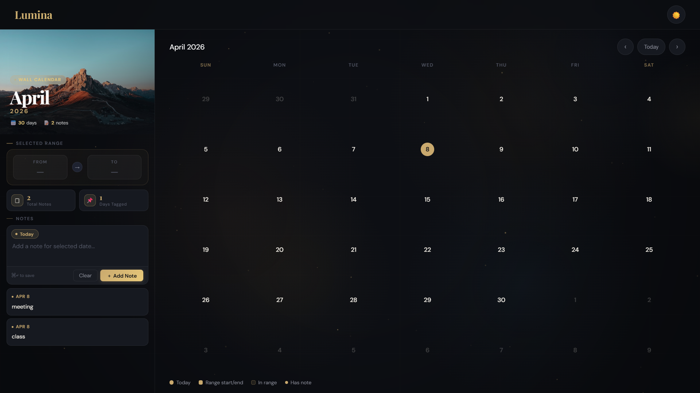
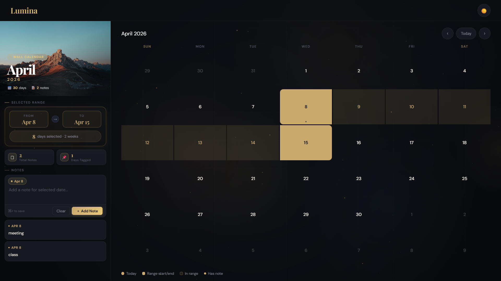

# 🗓 Lumina Calendar

A premium, production-ready interactive wall calendar built with **Next.js**.

## ✨ Features

- 🎨 **Premium Wall Calendar UI** — dark/light modes, gold accent system, Playfair Display typography
- 🌌 **Animated Canvas Background** — floating orbs, twinkling particles, shooting stars, mouse glow
- 📅 **Date Range Selection** — click start → click end, highlighted range with day count
- 📝 **Notes System** — add notes per date via sidebar or double-click modal, persisted via localStorage
- 🔁 **Month Navigation** — prev/next with smooth slide transitions
- 📱 **Fully Responsive** — desktop side-by-side, tablet/mobile stacked layout
- 🖱 **Micro-interactions** — hover effects, tooltip previews, animated day selection

## 📁 Project Structure

```
/project-root
├── /components
│   ├── Calendar.jsx      ← sidebar + calendar grid + range logic
│   ├── DayCell.jsx       ← individual day cell with tooltip
│   ├── Header.jsx        ← logo, theme toggle + canvas BG animation
│   └── NotesModal.jsx    ← double-click modal for notes
│
├── /pages
│   ├── _app.jsx          ← global CSS import
│   └── index.jsx         ← state management (notes, theme)
│
├── /styles
│   └── globals.css       ← all styles (CSS variables, layout, components)
│
├── package.json
└── README.md
```

## 🚀 Getting Started

### Prerequisites
- Node.js 18+ 
- npm or yarn

### Install & Run

```bash
# 1. Install dependencies
npm install

# 2. Start development server
npm run dev

# 3. Open in browser
open http://localhost:3000
```

### Build for Production

```bash
npm run build
npm start
```
### 📅 Calendar UI



## 🎮 How to Use

| Action | Result |
|--------|--------|
| Click a date | Sets range start |
| Click another date | Completes range |
| Hover a date with a note | Shows tooltip preview |
| Double-click a date | Opens notes modal |
| Sidebar textarea + Add Note | Adds note to selected date |
| ☀️/🌙 button | Toggles light/dark theme |
| ‹ / › buttons | Navigate months |
| Today button | Jump to current month |

## 🛠 Tech Stack

- **Next.js 14** — React framework
- **CSS Variables** — theming system (no Tailwind needed)
- **Canvas API** — animated background
- **localStorage** — note persistence

